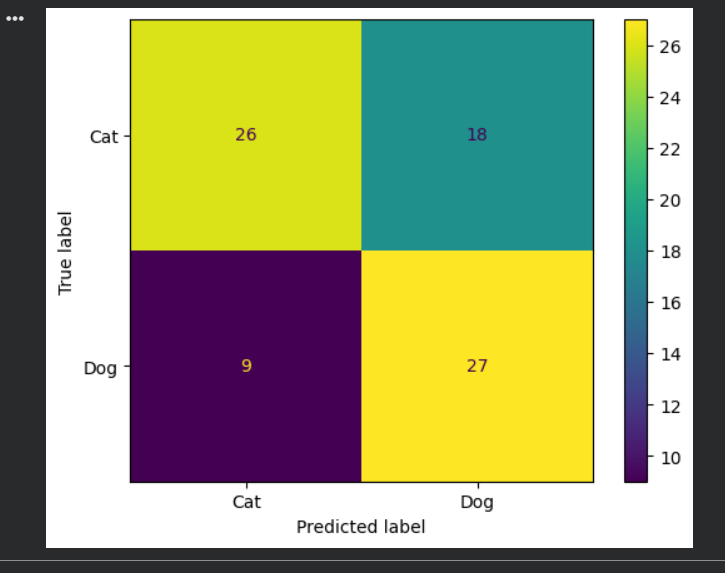
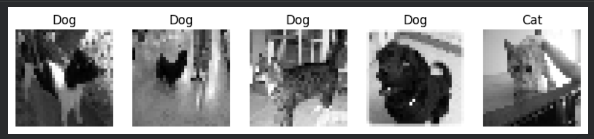

# SCT_ML_3

# Dogs vs Cats Classification using Support Vector Machine (SVM)

## 📌 Project Overview

This project aims to classify images of cats and dogs using a Support Vector Machine (SVM). The dataset contains images of cats and dogs, which were preprocessed and used to train an SVM model for image classification.

The project demonstrates image preprocessing, feature extraction, model training, evaluation, and visualization of results.

---

## 🎯 Objective

To build a machine learning model that can accurately classify images as either a cat or a dog using Support Vector Machine (SVM).

---

## 📂 Dataset

Dataset: Cats vs Dogs Dataset

The dataset contains images of cats and dogs used for binary image classification.

---

## 🛠 Technologies Used

- Python
- NumPy
- OpenCV
- Matplotlib
- Scikit-Learn
- Google Colab

---

## 📊 Data Preprocessing

- Converted images to grayscale
- Resized images to 32 × 32 pixels
- Flattened image data into feature vectors
- Normalized pixel values

---

## 🤖 Machine Learning Algorithm

### Support Vector Machine (SVM)

SVM is a supervised machine learning algorithm used for classification tasks. It identifies the optimal decision boundary between different classes.

---

## 📈 Model Evaluation

### Results

- Accuracy: **66.25%**

The model successfully learned patterns from cat and dog images and achieved satisfactory classification performance.

---

## 🔍 Confusion Matrix

| Actual / Predicted | Cat | Dog |
|-------------------|-----|-----|
| Cat | 26 | 18 |
| Dog | 9 | 27 |

---

## 📷 Sample Predictions

The model was tested on unseen images and successfully predicted cats and dogs.

---

## 🚀 Outcome

Successfully implemented an image classification system using Support Vector Machine (SVM) and gained hands-on experience in computer vision and machine learning.

This project was completed as part of my Machine Learning Internship at SkillCraft Technology.

---

# 📸 Project Screenshots

## Confusion Matrix

## Prediction Output

